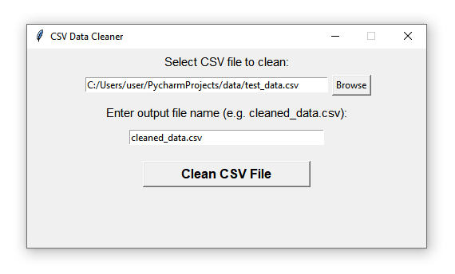

# 🧹 CSV Data Cleaner (Python + Tkinter)


## About the Project

CSV Data Cleaner is a desktop application built with **Python**, **Tkinter**, and **Pandas** for cleaning and standardizing CSV files.

The application removes unnecessary spaces, standardizes names and email addresses, removes rows with invalid or missing email addresses, and converts invalid purchase amounts to zero. Cleaned data is saved as a new CSV file.

## Screenshots

### Main Window



### File Selected


### Cleaned Result


## Features

* Select a CSV file using a file browser.
* Remove unnecessary spaces from text fields.
* Standardize name capitalization.
* Convert email addresses to lowercase.
* Validate email addresses.
* Remove rows with invalid or missing emails.
* Convert purchase amounts to numeric values.
* Replace invalid purchase amounts with `0`.
* Save cleaned data as a new CSV file.
* Display a cleaning summary after processing.
* Store test and output files locally.

## Technologies Used

* Python 3.7
* Tkinter
* Pandas
* Regular Expressions (`re`)
* pathlib

## Requirements

* Python **3.7**
* Pandas

Install the required package:

```bash
pip install -r requirements.txt
```

## Project Structure

```text
csv-data-cleaner-python/
├── csv_data_cleaner.py
├── data/
│   ├── test_data.csv
│   └── cleaned_data.csv
├── screenshots/
│   ├── main-window.png
│   ├── selected-file.png
│   └── cleaned-result.png
├── requirements.txt
├── .gitignore
└── README.md
```

## Installation

1. Clone this repository.
2. Install the required dependency:

```bash
pip install -r requirements.txt
```

3. Run the application:

```bash
python csv_data_cleaner.py
```

4. Select a CSV file to clean.
5. Enter the desired output filename.
6. Click **Clean CSV File**.

## Test Data

A sample `test_data.csv` file is included in the `data/` folder.

The test data contains examples of:

* Extra spaces
* Different name capitalization
* Uppercase email addresses
* Invalid email addresses
* Missing email addresses
* Invalid purchase amounts
* Valid purchase amounts

This allows the cleaning functionality to be tested easily.

## Future Improvements

* Support additional CSV cleaning rules.
* Detect duplicate rows.
* Allow users to select which columns to clean.
* Add a preview of the cleaned data before saving.
* Add support for Excel files.
* Add more detailed cleaning statistics.
* Add dark mode interface.
